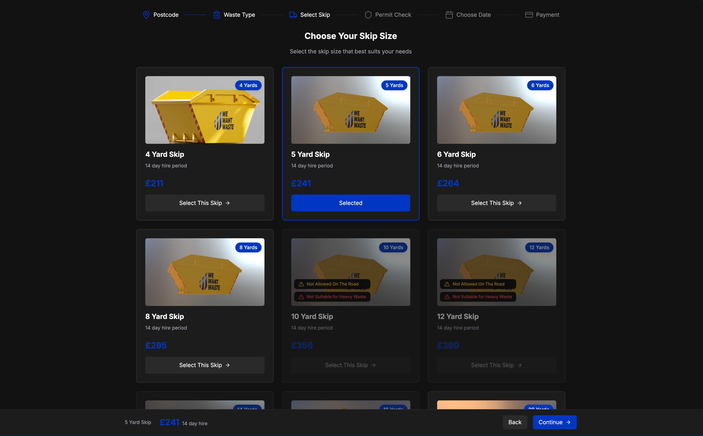
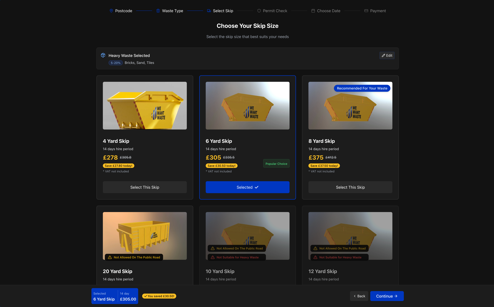
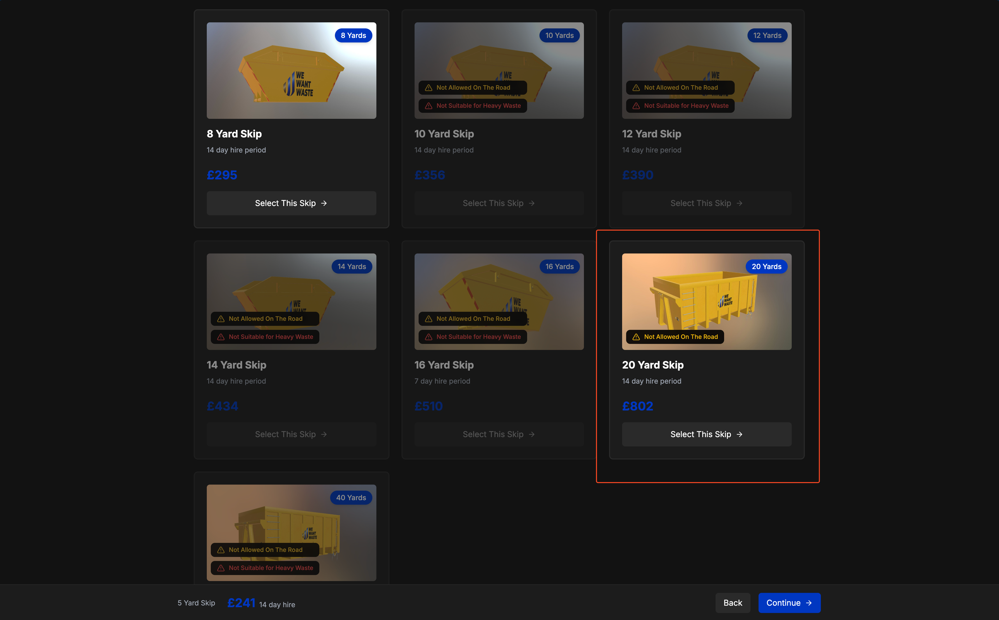
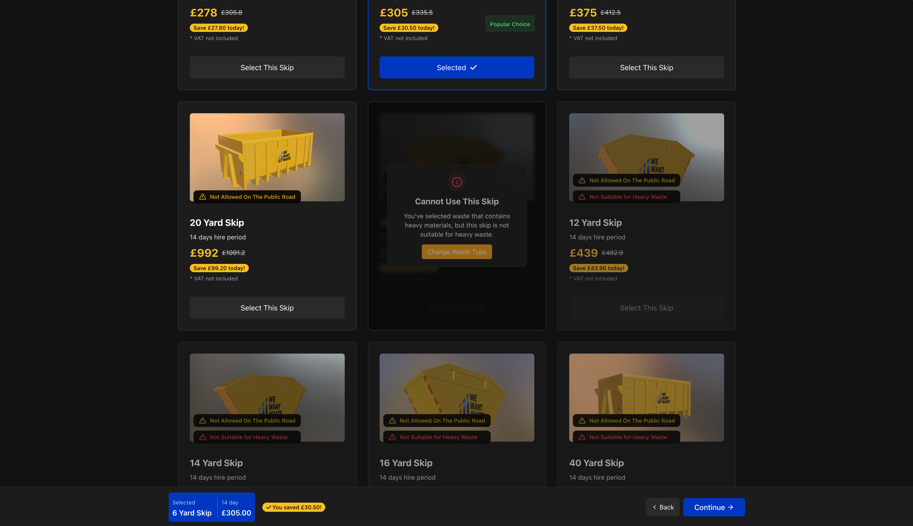
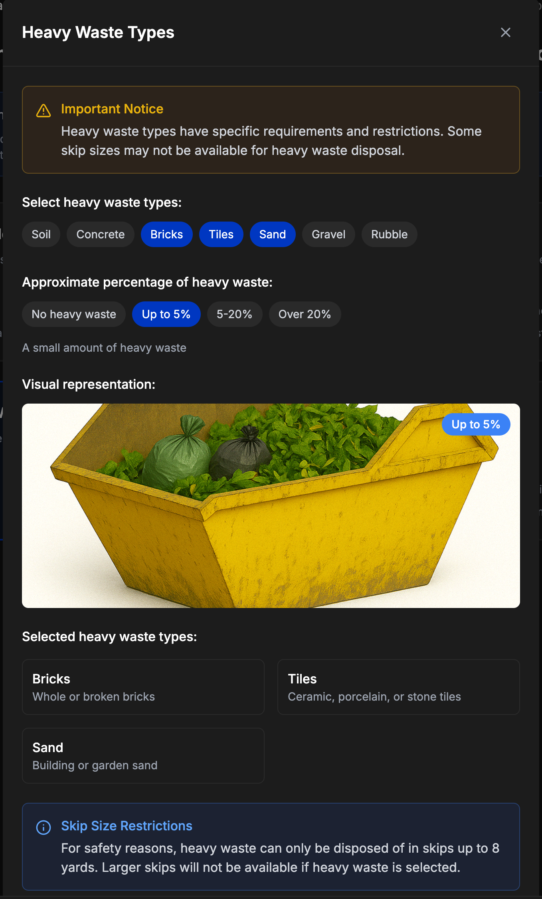
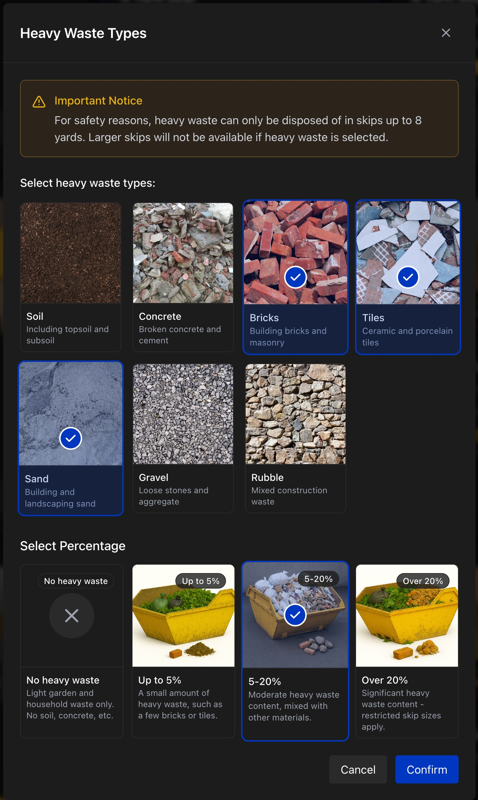

# SkipHire Showcase

A modern web application for skip hiring services, built with React, TypeScript, and Tailwind CSS using atomic design principles.

## Setup

Install the dependencies:

```bash
pnpm install
```

## Development

Start the dev server:

```bash
pnpm start
```

Build the app for production:

```bash
pnpm build
```

Preview the production build:

```bash
pnpm preview
```

Clear persistent cache local files:

```bash
pnpm clean
```

## Folder Structure

The project follows an atomic design pattern with a domain-driven approach:

```
src/
├── components/       # Global shared components
│   ├── atoms/        # Basic building blocks (buttons, inputs, etc.)
│   ├── molecules/    # Combinations of atoms (form fields, cards, etc.)
│   └── organisms/    # Complex UI components composed of molecules and atoms
├── constants/        # Application-wide constants
│   └── waste.ts      # Constants related to waste types and percentages
├── hooks/            # Global shared hooks
├── modules/          # Feature modules
│   ├── order/        # Order-related features
│   │   ├── components/  # Components specific to the order module
│   │   │   ├── atoms/
│   │   │   ├── molecules/
│   │   │   └── organisms/
│   │   ├── hooks/       # Hooks for the order module
│   │   ├── pages/       # Pages for the order module
│   │   └── store/       # Zustand store for the order module
│   ├── skips/           # Skip-related features
│   │   ├── components/  # Skip-specific components
│   │   └── hooks/       # Skip-specific hooks (e.g., useSkips)
│   └── waste/           # Waste-related features
│       ├── components/  # Waste-specific components
│       └── utils/       # Waste-specific utility functions
├── types/           # TypeScript type definitions
│   ├── skip.ts      # Skip-related types and interfaces
│   └── waste.ts     # Waste-related types and interfaces
└── utils/           # Utility functions
```

## Technology Stack

### Tailwind CSS

Tailwind CSS is used for styling components with a utility-first approach.

**Why Tailwind CSS?**
- **Utility-First**: Enables rapid UI development with predefined utility classes
- **Customization**: Easy to extend and customize through configuration
- **Performance**: Only includes the CSS that's actually used
- **Responsive Design**: Built-in responsive design utilities
- **Dark Mode**: Simple dark mode implementation

The project uses Tailwind CSS v3 configured through PostCSS:

```css
/* src/index.css */
@tailwind base;
@tailwind components;
@tailwind utilities;

:root {
  --color-primary: #0037c1;
  --color-card: #1c1c1c;
  --color-card-border: #2a2a2a;
}

@layer utilities {
  .bg-primary {
    background-color: var(--color-primary);
  }
  /* Other custom utilities... */
}
```

### Atomic Design Pattern

The codebase follows the atomic design methodology, organizing components into:

- **Atoms**: Basic building blocks (buttons, inputs, icons)
- **Molecules**: Combinations of atoms (form fields, cards)
- **Organisms**: Complex UI sections (headers, skip grids)
- **Pages**: Complete views composed of organisms

This approach offers:
- **Consistency**: Reusable components ensure UI consistency
- **Maintainability**: Changes to base components cascade throughout the application
- **Efficiency**: Components can be developed and tested in isolation
- **Scalability**: Easy to add new features by composing existing components

### Zustand

Zustand is used for state management across the application.

**Why Zustand?**
- **Simplicity**: Minimal boilerplate compared to Redux
- **TypeScript Integration**: Strong typing support
- **Atomic Updates**: Fine-grained control over state updates
- **Middleware Support**: Enables persistence, logging, etc.
- **Performance**: Minimizes re-renders with its subscription model

Example (from `src/modules/order/store/useOrderStore.ts`):
```tsx
const useOrderStore = create<OrderStore>((set) => ({
  selectedSkip: null,
  heavyWasteInfo: null,
  setSelectedSkip: (skip) => set({ selectedSkip: skip }),
  setHeavyWasteInfo: (info) => set({ heavyWasteInfo: info }),
}));
```

### TanStack Router

TanStack Router (formerly React Router) handles client-side routing.

**Why TanStack Router?**
- **Type Safety**: First-class TypeScript support
- **Data Fetching**: Built-in data loading and prefetching capabilities
- **Search Params**: Strongly typed URL search parameters
- **Code Splitting**: Automatic route-based code splitting
- **Redirects & Guards**: Native support for route guards and redirects

Example (from `src/router.tsx`):
```tsx
const rootRoute = createRootRoute({
  component: RootLayout,
  errorComponent: ErrorPage,
});

const indexRoute = createRoute({
  getParentRoute: () => rootRoute,
  path: '/',
  beforeLoad: () => {
    throw redirect({ to: '/order/select-skip' });
  },
});
```

### TanStack Query

TanStack Query (formerly React Query) manages data fetching, caching, and synchronization.

**Why TanStack Query?**
- **Automatic Caching**: Built-in request deduplication and caching
- **Background Updates**: Automatic refetching and stale-while-revalidate
- **Loading & Error States**: Simple handling of loading and error states
- **Pagination & Infinite Scrolling**: First-class support
- **Optimistic Updates**: Improve perceived performance

Example (from `src/modules/skips/hooks/useSkips.ts`):
```tsx
export function useSkips() {
  return useQuery({
    queryKey: ['skips'],
    queryFn: async () => {
      // Fetch data from API
      const response = await fetch(API_URL);
      const data = await response.json();
      return data.map(mapSkipData);
    },
  });
}
```

## Performance Optimizations

### Image Optimization

This project implements automated image optimization using Gulp and Sharp to improve page load times and performance:

```javascript
// gulpfile.js
const gulp = require('gulp');
const sharp = require('sharp');
const path = require('path');
const fs = require('fs-extra');

async function optimizeFolder(subfolder) {
  const srcDir = path.join(imagesDir, subfolder);
  const destDir = path.join(imagesDir, subfolder + '_optimized');
  await fs.ensureDir(destDir);
  const files = (await fs.readdir(srcDir)).filter((file) =>
    /\.(jpe?g|png|webp)$/i.test(file),
  );

  await Promise.all(
    files.map(async (file) => {
      const inputPath = path.join(srcDir, file);
      const outputName = path.parse(file).name + '.webp';
      const outputPath = path.join(destDir, outputName);
      await sharp(inputPath).webp({ quality: 80 }).toFile(outputPath);
    }),
  );
}
```

**Key Features:**

- **WebP Conversion**: All images are converted to the modern WebP format for smaller file sizes
- **Quality Optimization**: Images are optimized at 80% quality, balancing visual fidelity with performance
- **Organized Structure**: Optimized images are stored in separate "_optimized" folders
- **Broad Format Support**: Works with JPEG, PNG, and existing WebP files

This optimization process significantly reduces image file sizes while maintaining visual quality, resulting in faster page loads and improved user experience.

## UI/UX Improvements

This project implements several significant improvements over the original [WeWantWaste](https://wewantwaste.co.uk/) website. The following changes enhance user experience and conversion rates:

### Skip Selection Enhancements

#### Original Version Issues


- **Missing Information**: No indication of recommended or popular skip options
- **Pricing Display**: Standard pricing without highlighting discounts
- **Selection Feedback**: Limited visual feedback on skip selection

#### Improved Version


- **Feature Badges**: Added "Popular" and "Recommended" badges to help users make informed decisions
- **Enhanced Pricing**: Clear display of original price with discount, making the offer more compelling
- **Selection Indicators**: Added check mark icons on selected skips for better user feedback
- **Waste Type Selection**: Added ability to modify previously selected waste type from this page

### Unavailable Skip Handling

#### Original Version Issues


- **Poor Organization**: Available skips mixed with unavailable ones, creating confusion
- **Unclear Messaging**: Lack of explanation why certain skips are unavailable

#### Improved Version


- **Clear Reasoning**: Added explicit explanation of why skips cannot be selected
- **Action Options**: Included button to change waste type when larger skip sizes are needed
- **Better Organization**: Improved skip ordering for better discoverability, so all available skips comes before unavailable skips

### Waste Selection Improvements

#### Original Version Issues


- **Limited Information**: Basic waste type selection without helpful context

#### Improved Version


- **Enhanced Information**: More detailed descriptions of waste types
- **Improved Interface**: Better visual layout and interaction design
- **User Guidance**: Clearer direction on waste type selection process

### Bottom Bar Navigation Improvements

#### Original Version


#### Improved Version


- **Skip Summary Display**: Added catchy selected skip information including total hire days and saved price discount amount

These improvements result in a more intuitive, informative, and conversion-focused user experience.